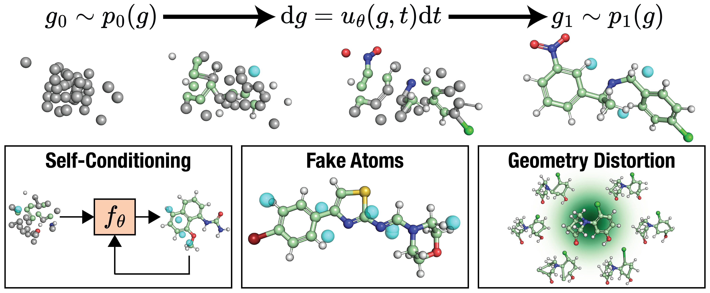

# FlowMol3: Flow Matching for 3D De Novo Small-Molecule Generation

[](https://arxiv.org/abs/2411.16644)



This is the offical implementation of FlowMol, a flow matching model for unconditional 3D de novo molecule generation. The current version is FlowMol3, which is described in the following paper:

## Citing FlowMol3 (and what's going on the the FlowMol versions?)

Unintentionally, FlowMol has gone through a few iterations of improvement. We have released three versions along with three preprints. FlowMol3 is the current and final version, it was released publicly on August 15th, 2025 and will (hopefully) soon find its home in a journal publication.

(flowmol3 citation goes here)

Earlier versions of FlowMol are still accessible (see next 2 sections), but we recommend using FlowMol3 for all new work.

### FlowMol1

This is the first FlowMol preprint. The code for this version is available at [this v0.1 tag](https://github.com/Dunni3/FlowMol/releases/tag/v0.1). Citation is below.

> Dunn, I. & Koes, D. R. Mixed Continuous and Categorical Flow Matching for 3D De Novo Molecule Generation. Preprint at https://doi.org/10.48550/arXiv.2404.19739 (2024).

### FlowMol2

FlowMol2 (referred to as FlowMol-CTMC originally) as presented the Machine Learning for Structural Biology workshop at NeurIPS 2024. Its available with the [FlowMol 2.0 release](https://github.com/Dunni3/FlowMol/releases/tag/v2.0). The primary difference between FlowMol1 and FlowMol2 is the use of CTMC-based discrete flow matching on categorical modalities. Citation is below.

> Dunn, I. & Koes, D. R. Exploring Discrete Flow Matching for 3D De Novo Molecule Generation. Preprint at https://doi.org/10.48550/arXiv.2411.16644 (2024).

# Environment Setup

You can build the environment using the following commands, assuming you have mamba installed. You could also use conda if you want.

```console
mamba env create -f environment.yml
mamba activate flowmol
pip install -e ./
```

# Using FlowMol3

The easiest way to start using trained models is like so:

```python
import flowmol
model = flowmol.load_pretrained().cuda().eval() # load model
sampled_molecules = model.sample_random_sizes(n_molecules=10, n_timesteps=250) # sample molecules
rdkit_mols = [ mol.rdkit_mol for mol in sampled_molecules ] # convert to rdkit molecules
```

The pretrained models that are available for use are described in the [trained models readme](flowmol/trained_models/readme.md) and can also be listed with `help(flowmol.load_pretrained)`. `flowmol.load_pretrained` will download trained models at runtime if they are not already present in the `flowmol/trained_models/` directory. You can manually download all available trained models following the instructions in the [trained models readme](flowmol/trained_models/readme.md).

## Notebook Example

There is a [notebook example available here](examples/flowmol_demo.ipynb).


# How we define a model (config files)

Specifications of the model and the data that the model is trained on are all packaged into one config file. The config files are just yaml files. Once you setup your config file, you pass it as input to the data processing scripts in addition to the training scripts. An example config file is provided at `configs/dev.yml`. This example config file also has some helpful comments in it describing what the different parameters mean.

Actual config files used to train models presented in the paper are available in the `flowmol/trained_models/` directory.

Note, you don't have to reprocess the dataset for every model you train, as long as the models you are training contain the same parameters under the `dataset` section of the config file. 

# Sampling
In addition to the sampling example provided in the "Using FlowMol3" section, you can also sample from a trained model using the `test.py` script which has some extra features built into it like returning sampling trajectories and computing metrics on the generated molecules. To sample from a trained model, using `test.py`, pass a trained model directory or a checkpoint with the `--model_dir` or `--checkpoint` arguments, respectively. Also noteably the `--reos_raw` argument will write a file containing all the raw results on the functional group and ring systems analysis.

Here's an example command to sample from a trained model:

```console
python test.py --model_dir=flowmol/trained_models/flowmol3 --n_mols=100 --n_timesteps=250 --output_file=brand_new_molecules.sdf
```

The output file, if specified, must be an SDF file. If not specified, sampled molecules will be written to the model directory. You can also have the script produce a molecule for every integration step to see the evolution of the molecule over time by adding the `--xt_traj` and/or `--ep_traj` flag. You can compute all of the metrics reported in the paper by adding the `--metrics` flag.

# Datasets

Our workflow for datasets is:
1. download the raw dataset
2. process the dataset using one of the `process_<dataset>.py` scripts. these scripts accept a config file as input. You can use one of the config files packaged with the trained models in the `trained_models/` directory.
3. now you will be able to train a model using the processed dataset, as long as the dataset configuration in the config file you use to train the model matches the dataset configuration in the config file you used to process the dataset.

<!-- ## QM9

Starting from the root of this repository, run these commands to download the raw qm9 dataset:
```console
mkdir data/qm9_raw
cd data/qm9_raw
wget https://deepchemdata.s3-us-west-1.amazonaws.com/datasets/molnet_publish/qm9.zip
wget -O uncharacterized.txt https://ndownloader.figshare.com/files/3195404
unzip qm9.zip
```

You can run this command to process the qm9 dataset:
```console
python process_qm9.py --config=configs/qm9_ctmc.yaml
``` -->

## GEOM-Drugs

We use the dataset files [created by MiDi](https://github.com/cvignac/MiDi). Run the following command from the root of this repository to download the geom-drugs dataset:

```console
wget -r -np -nH --cut-dirs=2 --reject "index.html*" -P data/ https://bits.csb.pitt.edu/files/geom_raw/
```

Then, from the root of this repository, run these commands to process the geom dataset:


```console
python process_geom.py data/geom_raw/train_data.pickle --config=configs/geom_ctmc.yml
python process_geom.py data/geom_raw/test_data.pickle --config=configs/geom_ctmc.yml
python process_geom.py data/geom_raw/val_data.pickle --config=configs/geom_ctmc.yml
```

Note that these commands assumed you have downloaded our trained models as described above.

# Training

Run the `train.py` script. You can either pass a config file, or you can pass a trained model checkpoint for resuming. Note in the latter case, the script assumes the checkpoint is inside of a directory that contains a config file. To see the expected file structure of a model directory, refer to the [trained models readme](flowmol/trained_models/readme.md). Here's an example command to train a model:

```console
python train.py --config=configs/flowmol3.yml
```
